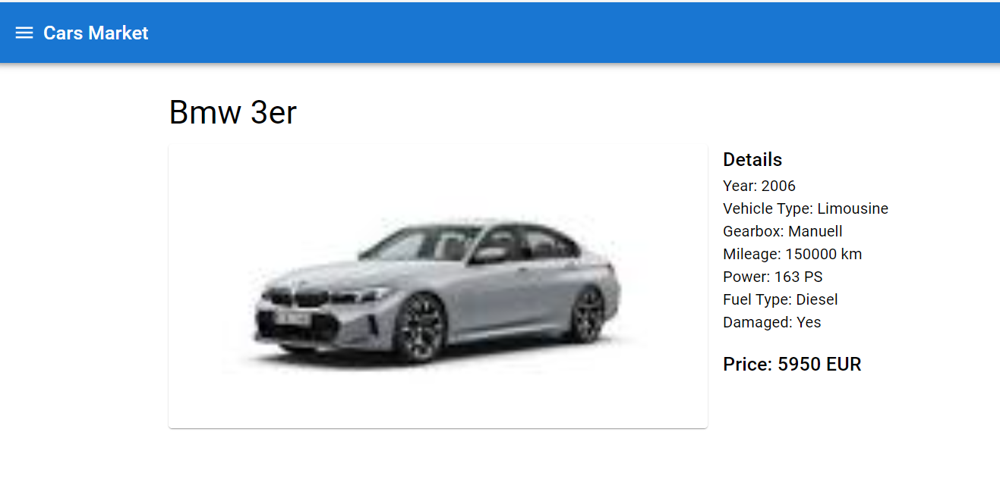

# Cars Market (built by [AutoCode](https://autocode.work) in 20 minutes)




## Overview

Cars Market is a web application for browsing and searching cars. It utilizes React for the frontend and a MongoDB + Express backend.

## Features

-   React v18 with Material-UI 5 for a modern, responsive UI
-   React Router v6 for seamless navigation
-   MongoDB backend with Express server
-   Auto-loading of CSV data on first run (autos.csv in server folder)
-   Advanced search capabilities with rich filtering options
-   High-quality car images from Google Images
-   ES6 imports and async/await for modern JavaScript practices
-   Docker support for easy deployment and scalability
-   Prometheus monitoring integration
-   Grafana dashboard for visualizing metrics

## Project Structure

```
cars-market/
├── docker-compose.yml
├── Dockerfile
├── grafana-dashboard.json
├── landing.html
├── package.json
├── prometheus.yml
├── public/
│   └── index.html
├── src/
│   ├── App.js
│   ├── index.js
│   └── useInput.js
└── server/
    ├── index.js
    └── package.json
```

## Design Ideas and Considerations

1. Implement server-side pagination for improved performance with large datasets
2. Add user authentication and personalized favorites list
3. Integrate a recommendation system based on user preferences and browsing history
4. Implement real-time updates for new car listings using WebSockets
5. Add a compare feature to allow users to compare multiple cars side-by-side
6. Implement lazy loading for images to improve initial load time
7. Add internationalization support for multiple languages
8. Implement a mobile app using React Native for cross-platform compatibility
9. Add a dealer portal for managing car listings
10. Implement caching strategies to reduce database load and improve response times
11. Add social sharing features for car listings
12. Implement a review and rating system for cars and dealers
13. Add a chat feature for users to communicate with dealers
14. Implement advanced analytics to track user behavior and improve the user experience
15. Add a newsletter subscription feature for updates on new listings and promotions

## Upcoming Improvements

-   Remove dark theme switch for a more focused user interface
-   Add server/autos.csv to Docker image for automatic data loading on first run
-   Replace any Unsplash images with more relevant car images
-   Implement error handling and logging for better debugging and monitoring
-   Add unit and integration tests for improved code reliability
-   Optimize Docker configuration for production deployment
-   Implement CI/CD pipeline for automated testing and deployment
-   Add input validation and sanitization for improved security
-   Implement rate limiting to prevent API abuse
-   Add a sitemap and improve SEO optimization

## Getting Started

1. Clone the repository
2. Install dependencies using `npm install` in both the root and server directories
3. Start the development server using `npm run dev`
4. Access the application at `http://localhost:3000`

## Contributing

Contributions are welcome! Please read our contributing guidelines and code of conduct before submitting pull requests.

## License

This project is licensed under the MIT License.
