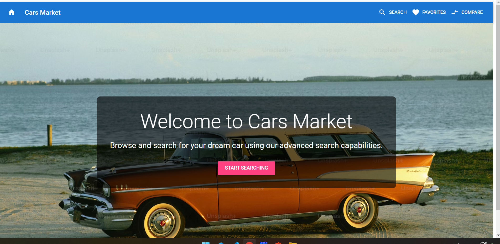
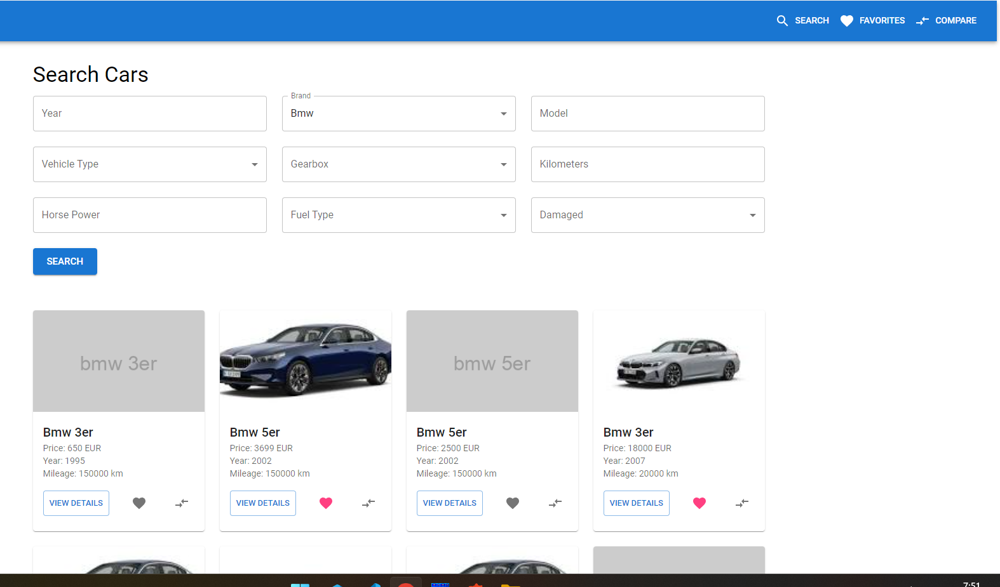
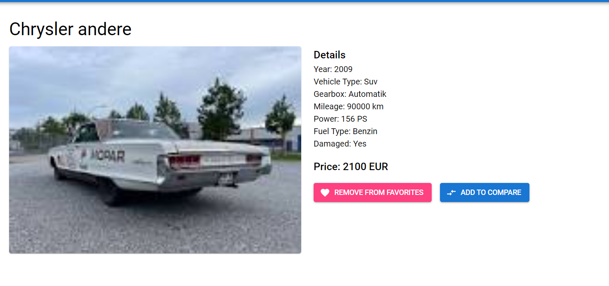

# Cars Market (built by [AutoCode](https://autocode.work) in 20 minutes)







## Overview

Cars Market is a web application for browsing and searching cars. It utilizes React for the frontend and a MongoDB + Express backend.

## Features

-   React v18 with Material-UI 5 for a modern, responsive UI
-   React Router v6 for seamless navigation
-   MongoDB backend with Express server
-   Auto-loading of CSV data on first run (autos.csv in server folder)
-   Advanced search capabilities with rich filtering options
-   High-quality car images from Google Images
-   ES6 imports and async/await for modern JavaScript practices
-   Docker support for easy deployment and scalability
-   Prometheus monitoring integration
-   Grafana dashboard for visualizing metrics
-   Dark mode support
-   Favorites functionality
-   Car comparison feature

## Project Structure

```
cars-market/
├── docker-compose.yml
├── Dockerfile
├── grafana-dashboard.json
├── landing.html
├── package.json
├── playground-1.mongodb.js
├── prometheus.yml
├── public/
│   └── index.html
├── src/
│   ├── App.js
│   ├── index.js
│   ├── services/
│   │   └── api.js
│   ├── hooks/
│   │   ├── useCompare.js
│   │   ├── useDarkMode.js
│   │   └── useFavorites.js
│   └── components/
│       ├── CarCard.js
│       ├── CarDetails.js
│       ├── Compare.js
│       ├── Favorites.js
│       ├── Header.js
│       ├── Home.js
│       ├── Search.js
│       └── SearchForm.js
└── server/
    ├── index.js
    └── package.json
```
